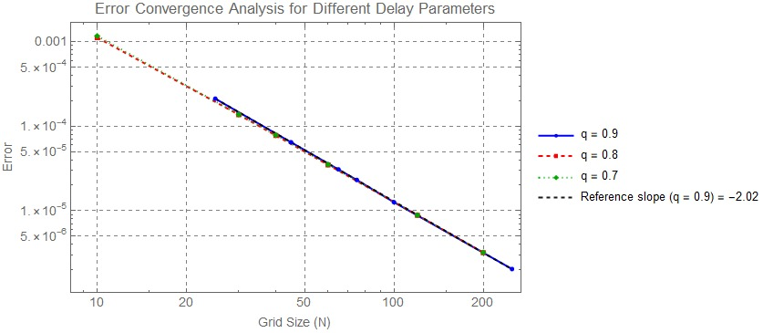
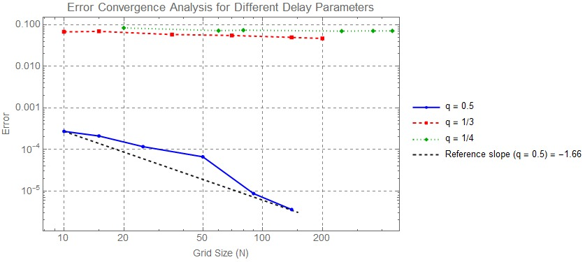

# Numerical Analysis of Delay Differential Equations with Applications in Computational Modeling and AI

## Convergence and Error Analysis using Collocation-Based Methods
This project reflects my approach to structured computational modeling, with a focus on stability, convergence, and scalable numerical methods relevant to modern learning systems.

  

This repository presents a structured collocation-based numerical framework for solving Volterra delay differential equations, with an emphasis on convergence, stability, and scalable computational modeling.

**Highlights**
- Convergence and error analysis for benchmark problems
- Log-log numerical plots with reference slopes
- Reproducible Mathematica implementation
- Potential relevance to optimization and learning-based dynamical modeling
  
---

## 📌 Overview

This project develops and analyzes numerical methods for solving Volterra delay differential and integral equations. The focus is on convergence analysis, stability properties, and systematic error evaluation across different test cases.

---

## ⚙️ Methodology

- Constructed a collocation-based numerical scheme using quadrature nodes and weights  
- Designed interpolation basis functions for solution approximation  
- Incorporated delay terms using fractional indexing and decomposition techniques  
- Implemented iterative solvers for nonlinear systems at each discretized time step
- While the implementation is developed in Wolfram Mathematica, the underlying methodology is general and can be extended to Python-based machine learning frameworks.

---

## 🧠 Mathematical Framework

The approach is based on:

- Volterra delay differential and integral equations  
- Collocation and quadrature methods  
- Stability and convergence theory  
- Error estimation techniques  

---

## 💻 Implementation

- Implemented in Wolfram Mathematica  
- Developed algorithms for time discretization and numerical approximation  
- Handled delay terms using floor-based indexing and interpolation  
- Solved nonlinear systems iteratively at each step  

---

## 📊 Numerical Results

Two benchmark problems with known exact solutions are considered.

---

### Example 1: Numerical Results for y(t) = sin(t)

The table reports the numerical error for different values of the delay parameter q, using m = 2, as the number of grid points N increases.
The results demonstrate consistent error reduction as the grid size increases, indicating stable convergence behavior across different delay parameters.

#### Case 1: q = 0.5

| m | N   | Error   |
|---|-----|---------|
| 2 | 10  | 2.73e-4 |
| 2 | 15  | 2.11e-4 |
| 2 | 25  | 1.17e-4 |
| 2 | 50  | 6.66e-5 |
| 2 | 90  | 8.69e-6 |
| 2 | 140 | 3.58e-6 |

The error decreases significantly with increasing N, suggesting strong convergence for moderate delay values.

---

#### Case 2: q = 1/3

| m | N   | Error   |
|---|-----|---------|
| 2 | 10  | 6.77e-2 |
| 2 | 15  | 6.97e-2 |
| 2 | 35  | 5.84e-2 |
| 2 | 70  | 5.54e-2 |
| 2 | 140 | 4.99e-2 |
| 2 | 200 | 4.70e-2 |

The convergence rate is slower compared to q = 0.5, indicating increased numerical difficulty for smaller delay parameter.
---

#### Case 3: q = 1/4

| m | N   | Error   |
|---|-----|---------|
| 2 | 20  | 8.44e-2 |
| 2 | 60  | 7.24e-2 |
| 2 | 80  | 7.43e-2 |
| 2 | 250 | 7.06e-2 |
| 2 | 360 | 7.15e-2 |
| 2 | 450 | 7.16e-2 |

The error reduction is less pronounced, reflecting potential challenges in approximating solutions with smaller delay values.

---

### 📈 Convergence Analysis (y(t) = sin(t))

  

<em>
Figure 1: Error convergence behavior for different delay parameters (q = 0.5, 1/3, 1/4) in a log-log scale. The reference line indicates the expected convergence rate.
</em>

---

### 🔍 Observation  
The results reveal distinct convergence behavior across different delay parameters. For moderate delay values (q = 0.5), the numerical error decreases steadily as the grid size increases, closely following the expected convergence trend.

In contrast, for smaller delay parameters (q = 1/3 and q = 1/4), the error shows limited reduction with increasing grid resolution, indicating slower convergence and increased numerical difficulty.

Overall, the method demonstrates stable and accurate convergence for moderate delay values, while its performance degrades for smaller delays, highlighting a limitation of the approach.

### Example 2: Numerical Results for y(t) = cosh(t)

The table presents the numerical error for different values of the delay parameter q, using m = 2, as the number of grid points N increases.
**The results demonstrate consistent error reduction as the grid size increases, confirming stable convergence behavior across different delay parameters.**

#### Case 1: q = 0.9

| m | N   | Error   |
|---|-----|---------|
| 2 | 25  | 2.12e-4 |
| 2 | 45  | 6.46e-5 |
| 2 | 65  | 3.08e-5 |
| 2 | 75  | 2.31e-5 |
| 2 | 100 | 1.26e-5 |
| 2 | 250 | 2.04e-6 |

The error decreases steadily as N increases, indicating strong and stable convergence for large delay values.
---

#### Case 2: q = 0.8

| m | N   | Error   |
|---|-----|---------|
| 2 | 10  | 1.12e-3 |
| 2 | 30  | 1.37e-4 |
| 2 | 40  | 7.77e-5 |
| 2 | 60  | 3.49e-5 |
| 2 | 120 | 8.83e-6 |
| 2 | 200 | 3.19e-6 |

The convergence behavior remains consistent, with a clear reduction in error as the grid size increases, suggesting reliable numerical performance.
---

#### Case 3: q = 0.7

| m | N   | Error   |
|---|-----|---------|
| 2 | 10  | 1.17e-3 |
| 2 | 30  | 1.38e-4 |
| 2 | 40  | 7.85e-5 |
| 2 | 60  | 3.52e-5 |
| 2 | 120 | 8.86e-6 |
| 2 | 200 | 3.20e-6 |

The method continues to exhibit stable convergence, although slight variations in error reduction indicate increased sensitivity compared to larger delay values.

---

### 📈 Convergence Analysis (y(t) = cosh(t))

  

<em>
Figure 2: Log–log convergence of numerical error for different delay parameters (q = 0.9, 0.8, 0.7). All curves align closely with the reference slope, indicating consistent second-order convergence.
</em>

---

**Observation:**

The results demonstrate a highly consistent convergence behavior across all tested delay parameters. As the grid size increases, the numerical error decreases uniformly for q = 0.9, 0.8, and 0.7, with all curves closely overlapping.

The alignment of the numerical results with the reference slope confirms that the method achieves the expected second-order accuracy. Unlike the previous example, the convergence rate here is stable and largely independent of the delay parameter.

This indicates that the proposed numerical scheme is robust and reliable for this class of problems, maintaining both stability and accuracy across different delay values.

---

## 📈 Key Findings

- The numerical method demonstrates clear convergence behavior  
- Error decreases consistently with finer discretization  
- The approach remains stable across different delay parameters and kernel functions  
- The method is robust for both trigonometric and exponential-type solutions  

---

## 🚀 Relevance to Artificial Intelligence

This work is closely related to:

- Numerical optimization techniques used in machine learning  
- Dynamical systems modeling in AI  
- Stability and convergence analysis in iterative algorithms  
- Computational methods for data-driven modeling  

The computational structure of this work is relevant to optimization, dynamical systems, and numerical learning frameworks used in AI-related modeling.

---

## 📌 Conclusion

The proposed collocation-based method demonstrates stable and accurate convergence for solving Volterra delay differential equations.

The results confirm second-order accuracy for smooth cases, while highlighting sensitivity to smaller delay parameters, where convergence becomes less pronounced.

Overall, the method provides a reliable and effective framework, with strong performance in stable regimes and clearly identifiable limitations in more challenging scenarios.

---

## 📂 Repository Structure

- `figures/` — generated convergence plots
- `src/` — Mathematica notebooks and implementation files
- `README.md` — project overview, methodology, and numerical results

---

## 💻 Code

The Mathematica implementation of the proposed numerical schemes is available in:

- [Sin solution notebook](src/volterra_delay_equation_sin_solution.nb)
- [Cosh solution notebook](src/volterra_delay_equation_cosh_solution.nb)

These notebooks include:
- construction of the numerical scheme,
- delay handling,
- error computation,
- convergence analysis,
- generation of the reported plots.
